[`Introducción a Bases de Datos`](../README.md) > [`Sesión 05`](README.md) > `Ejercicios`

## Ejercicios Sesión 5

### 1. Objetivos :dart: 

- Aplicar los conceptos adquiridos durante la sesión.

### 2. Requisitos :clipboard:

1. MongoDB Compass instalado.

### 3. Desarrollo :rocket:

Las consultas se realizarán sobre la base `sample_training`.

Todas las consultas que realices deberás mantenerlas dentro del MongoDB Compass. Para hacer esto, da clic en el botón con los puntos `···` y en `Toogle Query History`. Busca la última consulta y agrégala a favoritos presionando el ícono con la estrella :star:.

1. Obtén los datos de contacto de cada compañía.
  * Usar colección *companies*
  * Proyectar
    ```json
      {email_address:1, phone_number:1}
    ```
  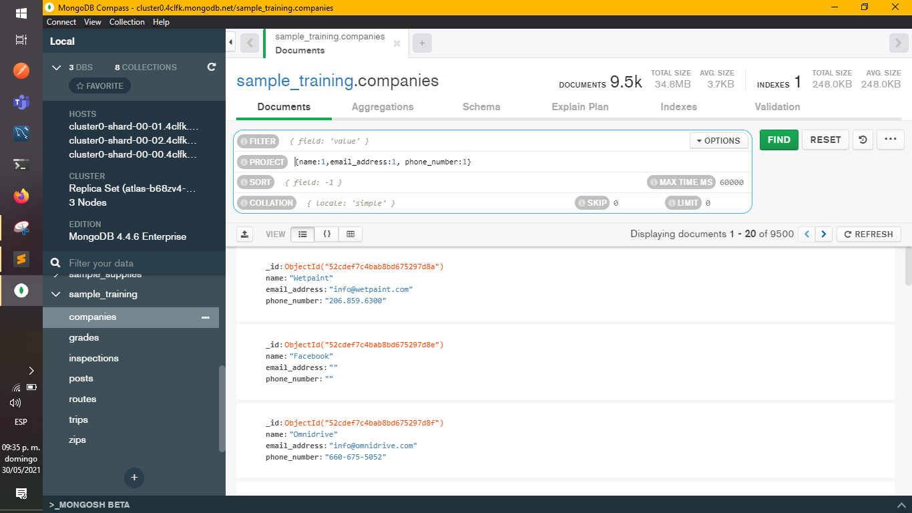

2. Obtén el identificador de la clase de cada calificación.
  * Usar colección *grades*
  * Proyectar
    ```json
      {class_id: 1}
    ```
  

3. Obtén el nombre de todas las compañias fundadas en octubre.
  * Usar colección *companies*
  * Filtrar
    ```json
      {founded_month:10}
    ```
  * Proyectar
    ```json
      {name:1}
    ```
  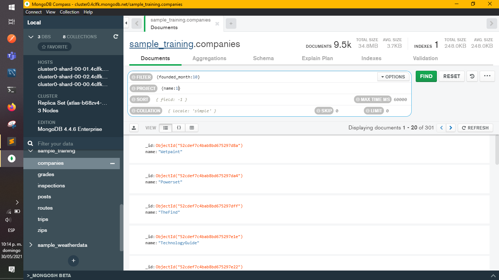

4. Obtén el nombre de todas las compañías fundadas en 2008.
  * Usar colección *companies*
  * Filtrar
    ```json
      {founded_year:2008}
    ```
  * Proyectar
    ```json
      {name:1}
    ```
  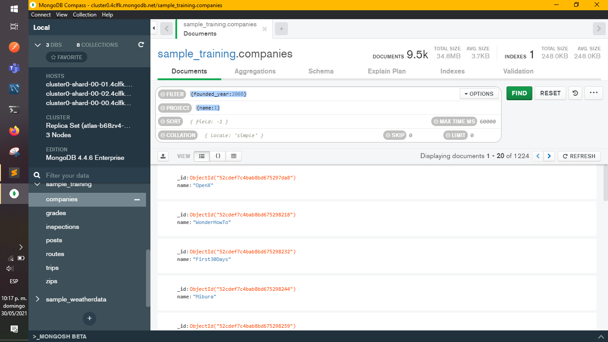

5. Obtén todos los *post* del autor `machine`.
  * Usar colección *posts*
  * Filtrar
    ```json
      {author:"machine"}
    ```
  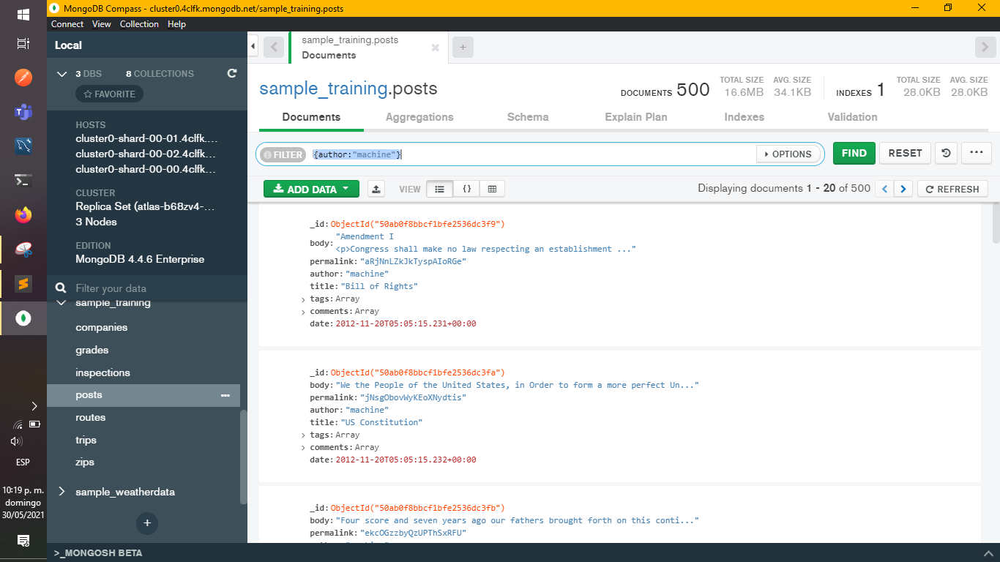

6. Obtén todas las calificaciones provenientes de los grupos `357`, `57` y `465`.
  * Usar colección *grades*
  * Filtrar
    ```json
    {$or:
      [
        {class_id: 357},
        {class_id: 57},
        {class_id: 465}
      ]
    }
    ```
  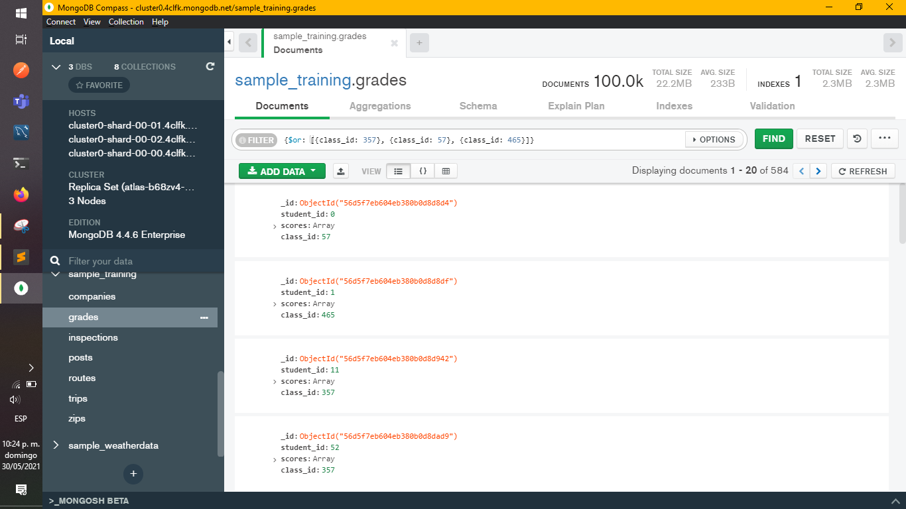

7. Obtén todas las compañías fundadas en octubre del 2008.
  * Usar colección *companies*
  * Filtrar
    ```json
      {founded_month:10, founded_year:2008}
    ```
  * Proyectar
    ```json
      {name:1}
    ```
  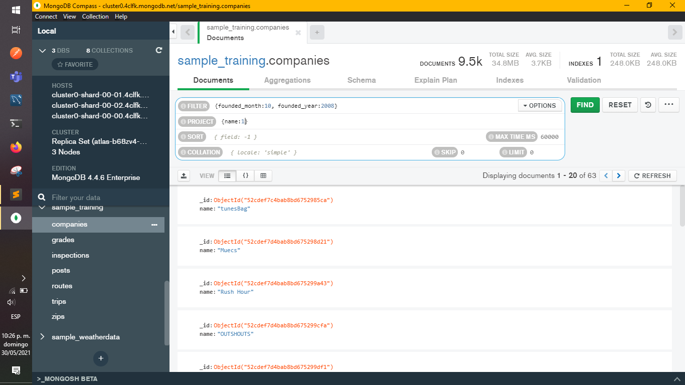

8. Obtén todas las compañias con más de 50 empleados. 
  * Usar colección *companies*
  * Filtrar
    ```json
      {number_of_employees: {$gt: 50}}
    ```
  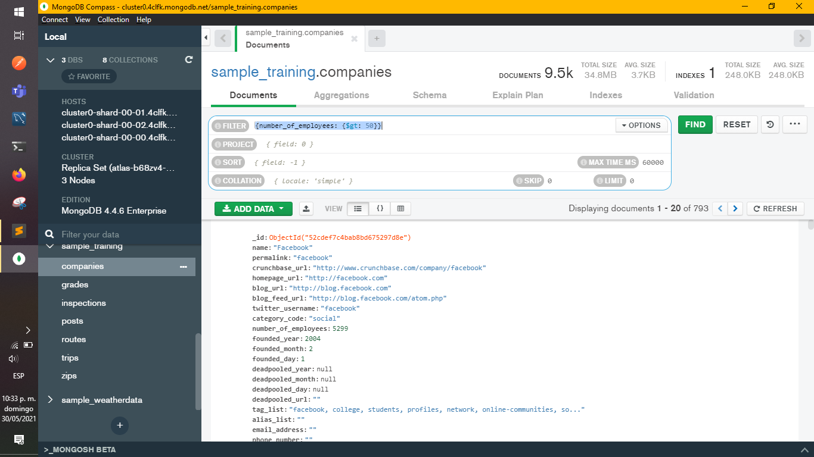

9. Obtén las rutas con un número de paradas entre 1 y 5.
  * Usar colección *routes*
  * Filtrar
    ```json
      {
        $and:
        [
          { stops: {$gte:1 }},
          { stops: {$lte:5 }}
        ]
      }
    ```
  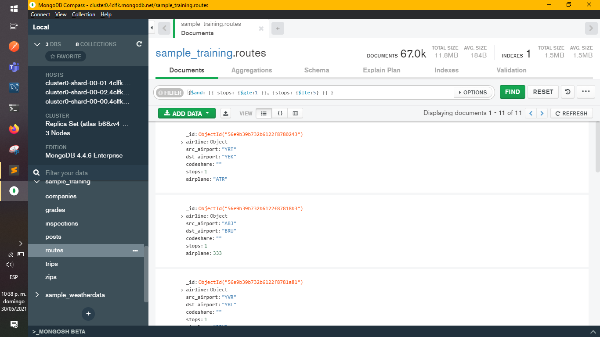

10. Obtén la empresa con el menor número de empleados.
  * Usar colección *companies*
  * Filtrar
    ```json
      {number_of_employees: {$ne:null}}
    ```
  * Ordenar
    ```json
      {number_of_employees:-1}
    ```
  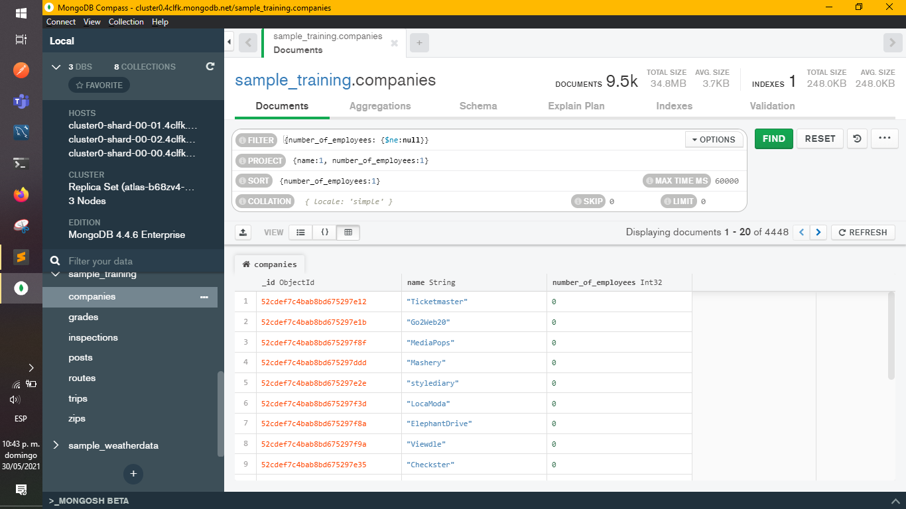

11. Obtén la empresa con el mayor número de empleados.
  * Usar colección *companies*
  * Filtrar
    ```json
      {number_of_employees: {$ne:null}}
    ```
  * Ordenar
    ```json
      {number_of_employees:-1}
    ```
  * Limitar a 1
  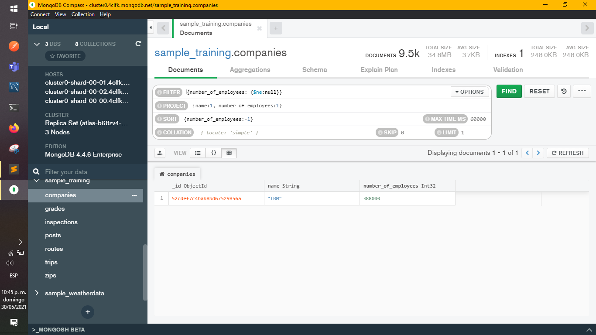

12. Obtén el viaje con mayor duración.
  * Usar colección *trips*
  * Ordenar
    ```json
      { tripduration: -1 }
    ```
  * Limitar a 1
  

13. Obtén el viaje con menor duración.
  * Usar colección *trips*
  * Ordenar
    ```json
      { tripduration: 1 }
    ```
  * Limitar a 1
  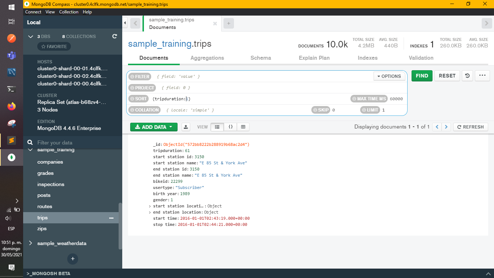

[`Anterior`](Reto-02.md) | [`Siguiente`](README.md)

