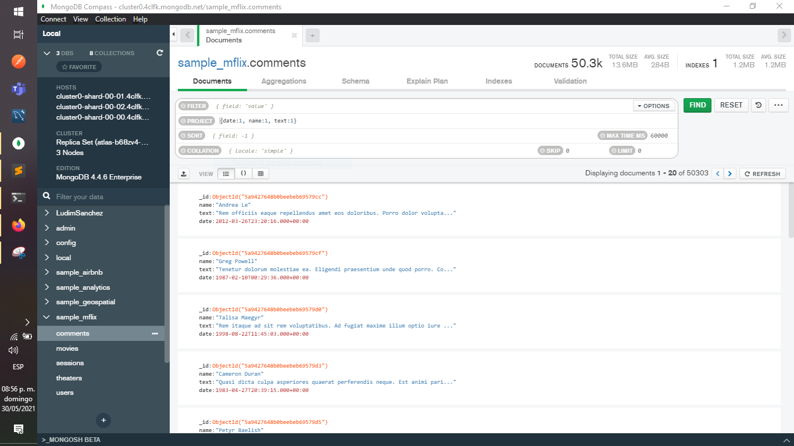
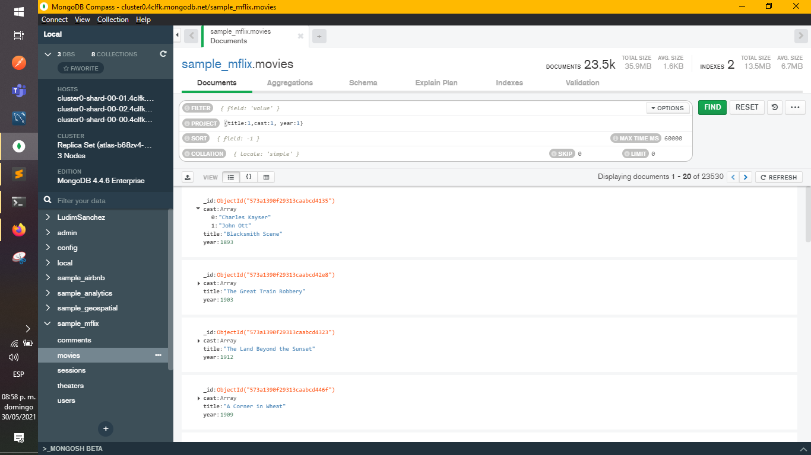
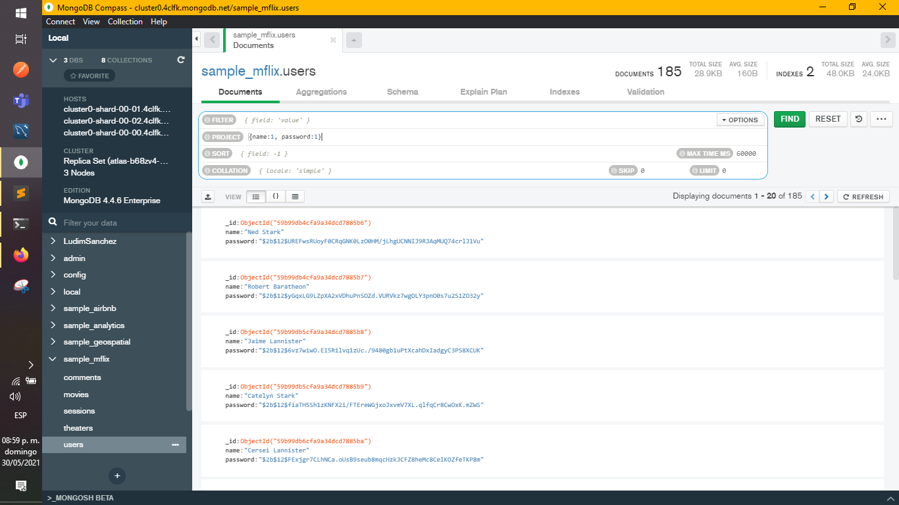

[`Introducción a Bases de Datos`](../README.md) > [`Sesión 05`](README.md) > `Reto 1`
    
## Reto 1: Colecciones, Documentos y Proyecciones

### 1. Objetivos :dart:

- Proyectar columnas sobre distintos documentos para repasar algunos conceptos.

### 2. Requisitos :clipboard:

1. MongoDB Compass instalado.

### 3. Desarrollo :rocket:

Usando la base de datos `sample_mflix`, proyecta los datos que se solicitan.

a) Fecha, nombre y texto de cada comentario.
  ```json
    {date:1, name:1, text:1}
  ```

  

b) Título, elenco y año de cada película.
  ```json
    {title:1,cast:1, year:1}
   ```
   
   

c) Nombre y contraseña de cada usuario.
  ```json
    {name:1, password:1}
  ```
   
  


[`Anterior`](README.md) | [`Siguiente`](Reto-02.md)
