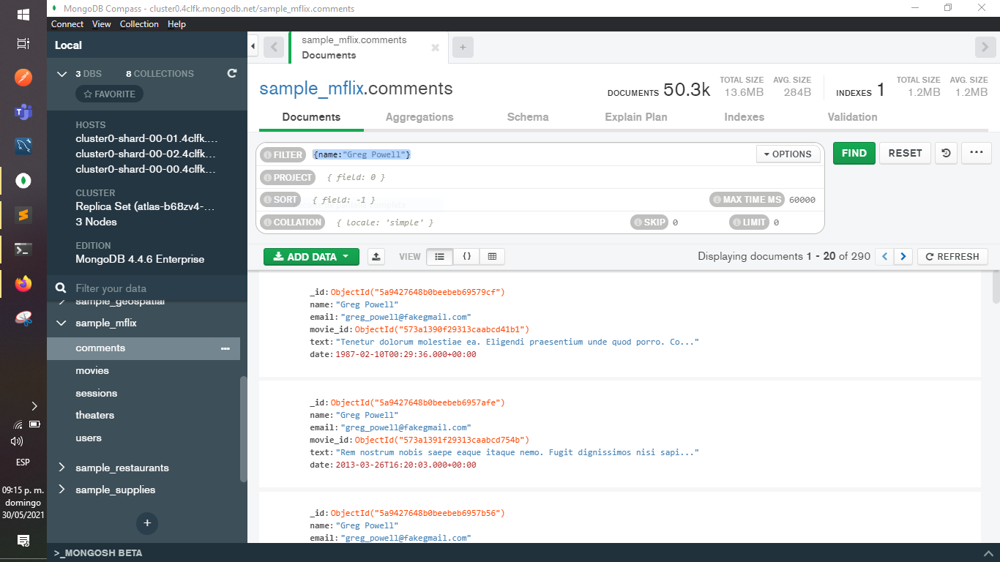
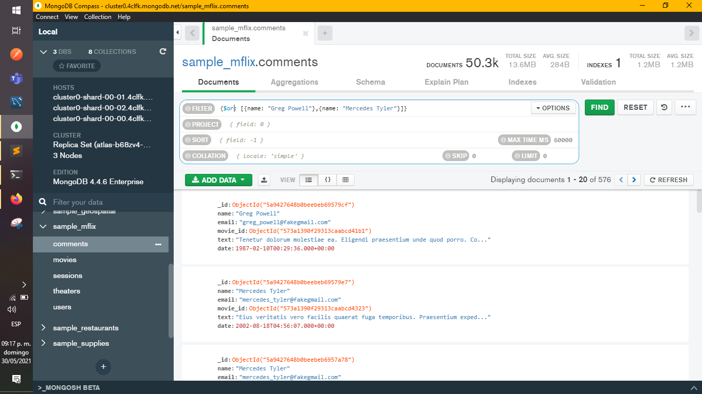
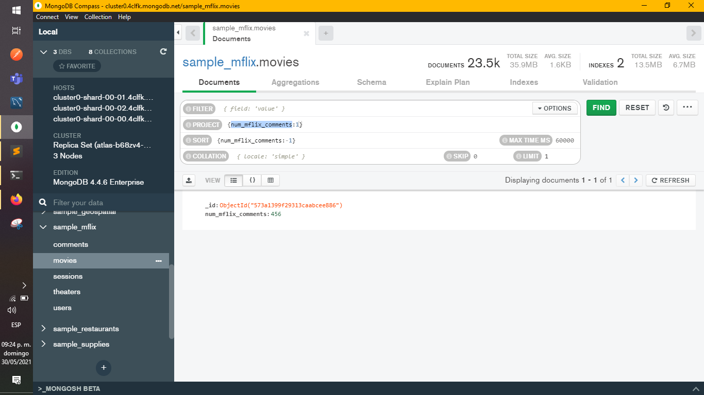
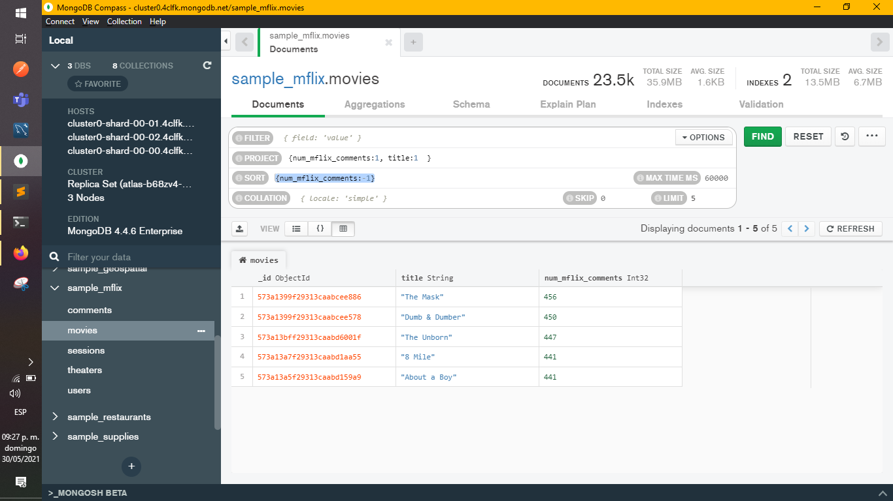

[`Introducción a Bases de Datos`](../README.md) > [`Sesión 05`](README.md) > `Reto 2`
    
## Reto 2: Filtros básicos


### 1. Objetivos :dart:

- Proyectar columnas sobre distintos documentos para repasar algunos conceptos.

### 2. Requisitos :clipboard:

1. MongoDB Compass instalado.

### 3. Desarrollo :rocket:

Usando la base de datos `sample_mflix`, agrega proyeccciones, filtros, ordenamientos y límites que permitan contestar las siguientes preguntas:

a) ¿Qué comentarios ha hecho Greg Powell?
* Usar colección comments
  ```json
    {name: "Greg Powell"}
  ```

  


b) ¿Qué comentarios han hecho Greg Powell o Mercedes Tyler?
* Usar colección comments
  ```json
    {$or:
      [
        {name: "Greg Powell"},
        {name: "Mercedes Tyler"}
      ]
    }
  ```

  


c) ¿Cuál es el máximo número de comentarios en una película?
* Usar colección movies
* Proyectar
  ```json
    {num_mflix_comments:1}
  ```
* Ordenar
  ```json
    {num_mflix_comments:-1}
  ```
* Limitar a 1

  


d) ¿Cuál es título de las cinco películas más comentadas?
* Usar colección movies
* Proyectar
  ```json
    {num_mflix_comments:1, title:1  }
  ```
* Ordenar
  ```json
    {num_mflix_comments:-1}
  ```
* Limitar a 5

  


[`Anterior`](Reto-01.md) | [`Siguiente`](Ejercicios.md)

