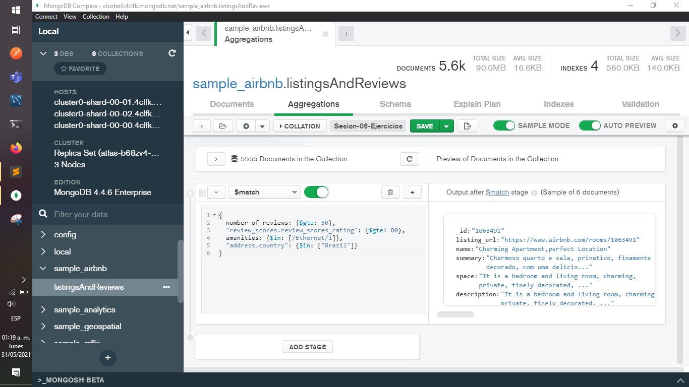

[`Introducción a Bases de Datos`](../../REAMDE.md) > [`Sesión 06`](../Readme.md) > `Ejercicios`
    
## Ejercicios Sesión 6

<div style="text-align: justify;">

### 1. Objetivos :dart: 

- Aplicar los conceptos adquiridos durante la sesión.

### 2. Requisitos :clipboard:

1. MongoDB Compass instalado.

### 3. Desarrollo :rocket:

Para este ejercicio deberás practicar en el uso de agregaciones, pues serán usadas durante la siguiente sesión.

La base de datos y colección que debes usar es `sample_airbnb.listingsAndReviews`.

El ejercicio consiste en :
* obtener todas las publicaciones que tengan 50 o más comentarios, 
* que la valoración sea mayor o igual a 80, 
* que cuenten con conexión a Internet vía cable y
* estén ubicadas en Brazil.

Añadir *aggregations* tipo `$match`
```json
  {
    number_of_reviews: {$gte: 50},
    "review_scores.review_scores_rating": {$gte: 80},
    amenities: {$in: [/Ethernet/i]},
    "address.country": {$in: ["Brazil"]}
  }
```


  

[`Anterior`](Reto-02.md) | [`Siguiente`](../Sesion-07/README.md)
