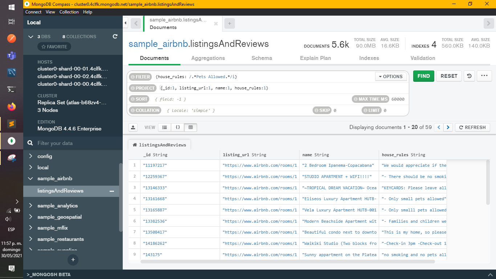
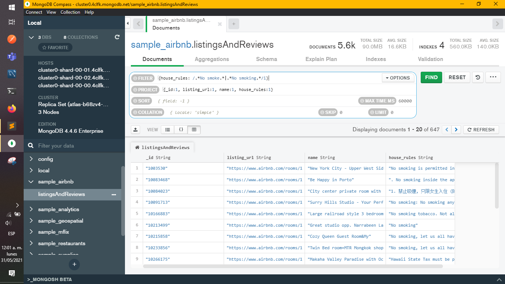

[`Introducción a Bases de Datos`](../README.md) > [`Sesión 06`](README.md) > `Reto 1`
    
## Reto 1: Expresiones regulares

### 1. Objetivos :dart: 

- Poner en práctica el uso de expresiones regulares.

### 2. Requisitos :clipboard:

1. MongoDB Compass instalado.

### 3. Desarrollo :rocket:

Usando la base de datos `sample_airbnb.listingsAndReviews`, realiza los siguientes filtros:

a) Propiedades que no permitan fiestas.
  ```json
    {house_rules: /.*No Parties.*/i}
  ```
  

b) Propiedades que admitan mascotas.
  ```json
    {house_rules: /.*Pets Allowed.*/i}
  ```
  

c) Propiedades que no permitan fumadores.
  ```json
    {house_rules: /.*No smoke.*|.*No smoking.*/i}
  ```
  

d) Propiedades que no permitan fiestas ni fumadores.
  ```json
    { house_rules: /.*No smoke.*|.*No smoking.*|.*No parties.*/i }
  ```
  

[`Anterior`](README.md) | [`Siguiente`](Reto-02.md)