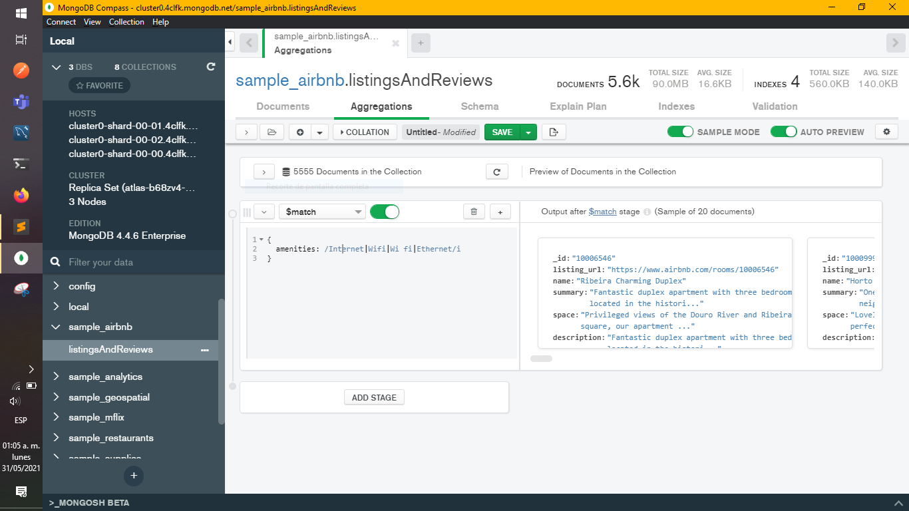
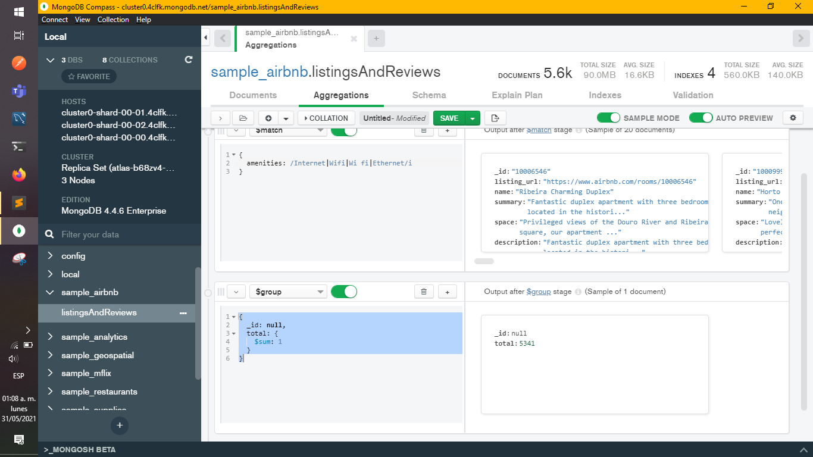

[`Introducción a Bases de Datos`](../README.md) > [`Sesión 06`](README.md) > `Reto 3`
    
## Reto 3: Introducción a las agregaciones

<div style="text-align: justify;">

### 1. Objetivos :dart: 

- Proyectar columnas sobre distintos documentos para repasar algunos conceptos.

### 2. Requisitos :clipboard:

1. MongoDB Compass instalado.

### 3. Desarrollo :rocket:

Usando la colección `sample_airbnb.listingsAndReviews`, mediante el uso de agregaciones, encontrar el número de publicaciones que tienen conexión a Internet, sea desde Wifi o desde cable (Ethernet).

1. Añadir *aggregations* tipo `$match`
  ```json
    {
      amenities: /Internet|Wifi|Wi fi|Ethernet/i
    }
  ```

  

2. Añadir *aggregations* tipo `$group`
  ```json
    {
      _id: null,
      total: {
        $sum: 1
      }
    }
  ```
   
  

[`Anterior`](Reto-02.md) | [`Siguiente`](Ejercicios.md)