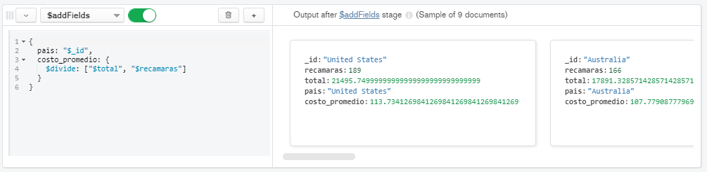

[`Introducción a Bases de Datos`](../../README.md) > [`Sesión 07`](../README.md) > `Reto 1`
  
## Reto 1: Agrupamientos

### 1. Objetivos :dart: 

- Poner en práctica el uso de agrupamientos.

### 2. Requisitos :clipboard:

1. MongoDB Compass instalado.
2. Acceso a la base de datos sample_airbnb.listingsAndReviews

### 3. Desarrollo :rocket:

Con base en el ejemplo 1, modifica el agrupamiento para que muestre el costo promedio por habitación por país de las propiedades de tipo casa.


a) Filtrar las propiedades de tipo casa. Usar la agregación `$match.`
  ```json
    {
      property_type: "House",
      bedrooms: {$gte: 1}
    }
  ```
  

b) Adicionalmente, calcular el costo por habitación. Usar la agregación `$addFields`
  ```json
    {
      costo_recamara: {$divide: ["$price", "$bedrooms"]}
    }
  ```
  

c) Agrupar la suma de recámaras y del total agrupando en este caso por país. Usar la agregación `$group`.
  ```json
    {
     _id: "$address.country",
     recamaras: {
       $sum: 1
     },
     total: {
       $sum: "$costo_recamara"
     }
    }
  ```
  
   
d) Hacer al calculo del costo promedio dividiendo el costo total y las recamaras. Usar la agreación `$addFields` y crear un alias como `_id` para guardar el país.
  ```json
    {
      pais: "$_id",
      costo_promedio: {
        $divide: ["$total", "$recamaras"]
      }
    }
  ```
  
   
e) Por último agregar una proyección para dejar los campos relevantes. Usar la agregación `project`.
  ```json
    {
      _id: 0,
      pais: 1,
      costo_promedio: 1
    }
  ```
  
 

[`Anterior`](README.md) | [`Siguiente`](Reto-02.md)
