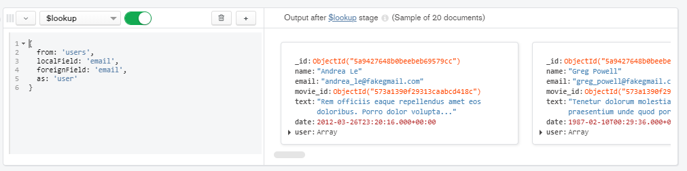
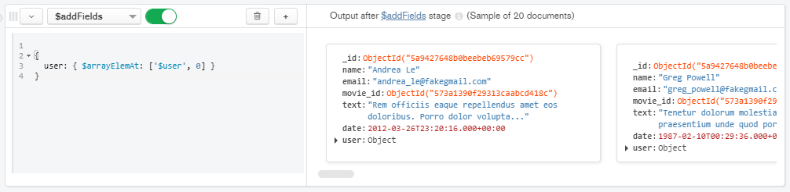
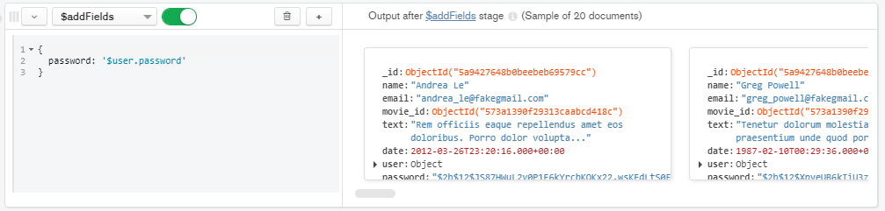
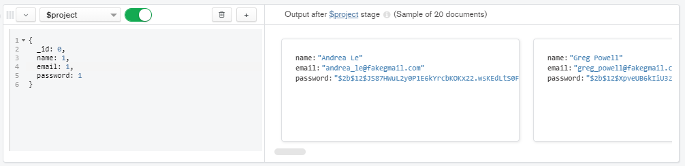

[`Introducción a Bases de Datos`](../README.md) > [`Sesión 07`](README.md) > `Reto 2`
    
## Reto 2: Asociación de colecciones

### 1. Objetivos :dart: 

- Proyectar columnas sobre distintos documentos para repasar algunos conceptos.

### 2. Requisitos :clipboard:

1. MongoDB Compass instalado.

### 3. Desarrollo :rocket:

Usando las colecciones `comments` y `users`, se requiere conocer el correo y contraseña de cada persona que realizó un comentario. Construye un pipeline que genere como resultado estos datos.

a) Usando la colección de `comments` buscar el usuario basado por email. Usar la agregación `$lookup` para traer la información del usuario.
```json
  {
    from: 'users',
    localField: 'email',
    foreignField: 'email',
    as: 'user'
  }
```


b) Traer la información del arreglo user guardada en el índice 0. Usar la agregación `$addFields`.
```json
  {
    user: { $arrayElemAt: ['$user', 0] }
  }
```


c) Agregar el campo password que esta dentro de la agregación creada anteriormente. Usar la agregación `$addFields`.
```json
  {
    password: '$user.password'
  }
```


d) Finalmente proyectar el nombre, email y password. Usar la agregación `$project`.
```json
  {
    _id: 0,
    name: 1,
    email: 1,
    password: 1
  }
```


[`Anterior`](Reto-01.md) | [`Siguiente`](Reto-03.md)
